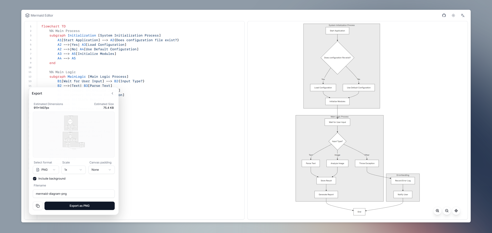
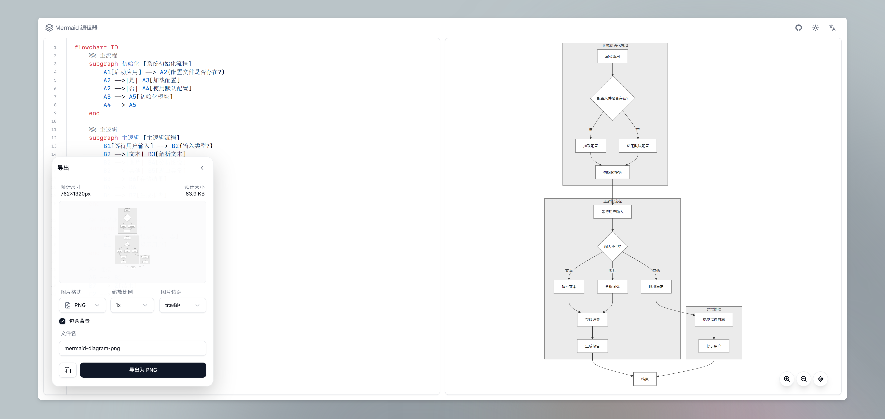

# Mermaid Editor

<p align="center">
  
  
  
  
  
</p>

<p align="center">
  A lightweight, personal Mermaid diagram editor built with Next.js. Optimised for focused writing, instant previews, and export-ready assets.
</p>

<details>
  <summary>Table of Contents</summary>

- [About The Project](#about-the-project)
  - [Key Features](#key-features)
  - [Built With](#built-with)
- [Getting Started](#getting-started)
  - [Prerequisites](#prerequisites)
  - [Installation](#installation)
  - [Useful Scripts](#useful-scripts)
- [Usage](#usage)
  - [Authoring Flow](#authoring-flow)
  - [Export Options](#export-options)
- [Technical Overview](#technical-overview)
  - [Architecture Highlights](#architecture-highlights)
  - [Project Structure](#project-structure)
  - [State & Rendering Flow](#state--rendering-flow)
  - [Localization & Theming](#localization--theming)
- [Community & Support](#community--support)
- [License](#license)
- [Acknowledgments](#acknowledgments)
- [中文文档](#中文文档)

</details>

---

## About The Project

Mermaid Editor delivers a two-pane authoring environment for Mermaid diagrams. Code editing relies on CodeMirror 6 with Mermaid language support, while rendering is handled by `mermaid@10` with theme-aware styling. The interface adapts to desktop and mobile layouts and keeps preferences in local storage so the workspace stays familiar on every visit.



### Key Features

- **Live authoring**: CodeMirror with Mermaid syntax highlighting, monospace styling, and placeholder guidance.
- **Responsive layout**: Split view on desktop, tabbed interface on mobile, both powered by the same editor surface.
- **Pan & zoom preview**: Smooth transforms, gantt-specific centring, and graceful degradation on large diagrams.
- **Export toolkit**: SVG cleanup, PNG/JPG/WebP generation with `html-to-image`, copy-to-clipboard fallbacks, custom padding.
- **Preferences that stick**: Theme (system-aware), language, export scale, and filename persist via Zustand storage.
- **Friendly messaging**: Toast notifications respect theme and locale, providing clear feedback for copy/export actions.

### Built With

- [Next.js 16.0.1][next-url] (App Router, Turbopack dev server)
- [TypeScript][typescript-url]
- [Tailwind CSS][tailwind-url] & [shadcn/ui][shadcn-url]
- [CodeMirror 6][codemirror-url] (`@uiw/react-codemirror`)
- [Mermaid.js][mermaid-url]
- [Zustand][zustand-url]
- [html-to-image][html-to-image-url]
- [lucide-react][lucide-url] & [react-hot-toast][toast-url]

---

## Getting Started

### Prerequisites

- Node.js 18 or newer
- npm (bundled with Node.js) — Yarn / pnpm are also compatible if you prefer

Verify your versions:

```bash
node --version
npm --version
```

### Installation

```bash
# clone the repository
git clone https://github.com/Nirnturt/mermaid-editor.git
cd mermaid-editor

# install dependencies
npm install
```

### Useful Scripts

```bash
npm run dev              # start the dev server (http://localhost:3003) with Turbopack
npm run build            # create an optimised production build
npm run start            # serve the production build locally
npm run build-and-start  # build and immediately start the production server
npm run lint             # run ESLint with Next.js defaults
```

---

## Usage

### Authoring Flow

1. Open the editor at [http://localhost:3003](http://localhost:3003) (dev) or your deployment URL.
2. Write Mermaid syntax in the CodeMirror panel; the preview updates instantly.
3. Toggle the theme switcher to align with system light/dark preferences, or choose manually.
4. Switch between English and Chinese through the language selector in the header.

### Export Options

- Supported formats: **SVG**, **PNG**, **JPG**, **WebP**.
- Adjustable scaling presets: `1×`, `1.5×`, `2×`, `3×`.
- Canvas padding options: none, small, medium, large.
- Background toggle for transparent or solid exports (JPG automatically enforces background).
- Copy actions:
  - Copy SVG markup directly to the clipboard.
  - Copy raster outputs when the browser allows `navigator.clipboard.write`.
  - Automatic fallback to file downloads on restricted browsers.

---

## Technical Overview

### Architecture Highlights

- **Routing & layout**: Next.js App Router under `app/`, leveraging client components for the editor experience.
- **Rendering helpers**: `lib/utils/mermaid.ts` wraps `mermaidAPI.render`, measures SVG bounds, and estimates file size.
- **State management**: `store/editor-store.ts` uses Zustand with JSON storage and legacy localStorage hydration.
- **Editor ergonomics**: `components/editor/code-input.tsx` wires CodeMirror themes, placeholder logic, and theme detection.
- **Preview runtime**: `components/editor/preview.tsx` coordinates rendering, pan/zoom gestures, gantt layout adjustments, and hydration guards.
- **Export pipeline**: `components/editor/export-panel.tsx` prepares output via `html-to-image`, manages Blob creation, and controls minimised panel state.
- **Animations & motion**: `config/motion.ts` centralises `motion` variants for subtle entry transitions.

### Project Structure

```text
app/                      # Next.js routes, layouts, metadata, global styles
components/editor/        # Editor shell, CodeMirror wrapper, preview, export panel
components/common/        # Shared UI pieces such as header, layout primitives
components/ui/            # shadcn/ui adaptations
config/                   # Motion settings, Mermaid theme tokens
lib/utils/                # Mermaid helpers, clipboard utilities, theme helpers
messages/                 # Localised copy (en, zh)
store/                    # Zustand state definition
public/img/               # Product screenshots used in documentation
```

### State & Rendering Flow

1. **Hydration**: On mount, `MermaidEditor` triggers Zustand rehydration and migrates legacy storage keys.
2. **Editing**: Code changes propagate through `setCode`, updating the persisted store.
3. **Rendering**: `renderMermaid` runs on code/theme/language changes, generating SVG and binding interactions.
4. **Metrics**: `getSvgSize` and `estimateFileSize` compute dimensions and size hints for the export panel.
5. **Exports**: Bitmap exports render off-screen canvases; clipboard operations gracefully downgrade when APIs are unavailable.

### Localization & Theming

- Strings live in `messages/en.json` and `messages/zh.json`; the language provider stores preference in localStorage.
- Theme handling uses `next-themes`, aligning CodeMirror colours with Tailwind tokens declared in `tailwind.config.ts`.
- Mermaid themes map to UI themes via `config/mermaid-themes.ts`, ensuring diagram colours match the surrounding UI.

---

## Community & Support

This is a personal side project without a formal roadmap. Issues and pull requests are welcome but may receive delayed responses. If you require changes urgently, consider forking the repository and maintaining your own build.

---

## License

Distributed under the [MIT License](LICENSE).

---

## Acknowledgments

- [Mermaid](https://mermaid.js.org/) for the diagram engine.
- [shadcn/ui](https://ui.shadcn.com/) for composable UI primitives.

---

## 中文文档

### 项目简介

Mermaid Editor 是一个基于 Next.js 的 Mermaid 图表编辑器，提供左右分屏创作体验。左侧 CodeMirror 编辑器支持 Mermaid 语法高亮，右侧预览由 `mermaid@10` 实时渲染，并支持主题与语言双向同步。界面适配桌面与移动设备，常用偏好会缓存到本地存储。



### 核心特性

- **实时编辑**：CodeMirror 6 搭配 Mermaid 语言插件，提供友好的占位符与行号样式。
- **自适应界面**：桌面端采用分屏布局，移动端切换为双标签结构。
- **预览操作**：支持平移、缩放，针对甘特图自动进行居中补偿。
- **导出能力**：SVG 清理、多格式位图导出、剪贴板复制与留白设置。
- **偏好持久化**：主题、语言、导出缩放和文件名均使用 Zustand 持久化保存。
- **提示反馈**：Toast 通知会随着主题和语言变化自动调整。

### 技术栈

- [Next.js][next-url]（App Router + Turbopack）
- [TypeScript][typescript-url]
- [Tailwind CSS][tailwind-url] / [shadcn/ui][shadcn-url]
- [CodeMirror 6][codemirror-url]（`@uiw/react-codemirror`）
- [Mermaid.js][mermaid-url]
- [Zustand][zustand-url]
- [html-to-image][html-to-image-url]
- [lucide-react][lucide-url]、[react-hot-toast][toast-url]

### 快速开始

```bash
git clone https://github.com/Nirnturt/mermaid-editor.git
cd mermaid-editor
npm install
npm run dev
```

默认使用 Node.js 18 以上版本，开发服务器运行在 `http://localhost:3003`。

### 使用说明

1. 在 CodeMirror 面板中输入 Mermaid 语法，右侧预览实时更新。
2. 通过语言切换器在中英文之间切换；主题切换支持浅色、深色和跟随系统。
3. 打开导出面板选择格式、缩放、画布留白和背景，可导出 SVG、PNG、JPG、WebP。
4. 若浏览器支持剪贴板权限，可直接复制 SVG 或位图；否则会自动回退为下载。

### 技术概览

- 路由与布局位于 `app/`，全部采用客户端组件。
- `store/editor-store.ts` 负责状态管理与本地存储迁移。
- `components/editor/preview.tsx` 处理渲染、手势、尺寸缓存与错误状态。
- `components/editor/export-panel.tsx` 调用 `lib/utils/mermaid.ts` 中的导出工具函数。
- 动画配置统一位于 `config/motion.ts`，保持交互轻量。
- 国际化文案存放在 `messages/en.json`、`messages/zh.json`。

### 目录结构

```text
app/                      # Next.js 路由与布局
components/editor/        # 编辑器、预览、导出面板
components/common/        # 公共布局组件
components/ui/            # 基于 shadcn/ui 的基础组件
config/                   # 动画、Mermaid 主题配置
lib/utils/                # Mermaid 辅助函数、剪贴板工具
messages/                 # 国际化文案
store/                    # Zustand 状态定义
public/img/               # 文档截图等静态资源
```

### 社区与支持

该项目为个人维护，更新频率有限。欢迎提交 Issues 或 Pull Requests，但响应可能较慢。若需要深度定制，建议 Fork 后自行维护。

### 许可证

遵循 [MIT License](LICENSE) 发布，可自由使用与修改。

### 致谢

- [Mermaid](https://mermaid.js.org/)
- [shadcn/ui](https://ui.shadcn.com/)

---

[next-url]: https://nextjs.org/
[typescript-url]: https://www.typescriptlang.org/
[tailwind-url]: https://tailwindcss.com/
[shadcn-url]: https://ui.shadcn.com/
[codemirror-url]: https://codemirror.net/6/
[mermaid-url]: https://mermaid.js.org/
[zustand-url]: https://zustand-demo.pmnd.rs/
[html-to-image-url]: https://github.com/bubkoo/html-to-image
[lucide-url]: https://lucide.dev/
[toast-url]: https://react-hot-toast.com/
