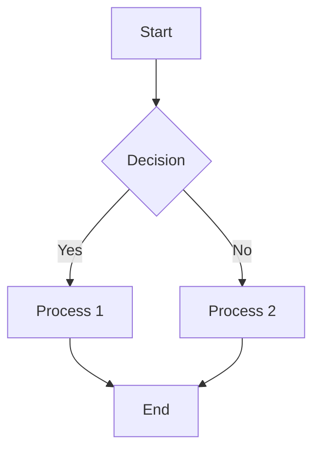
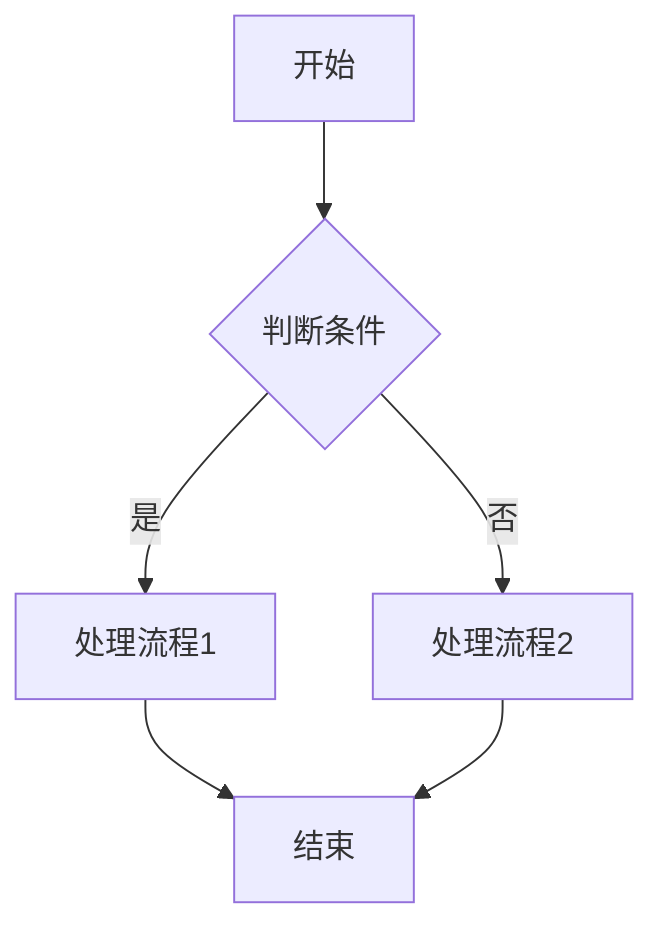

# Mermaid Editor | Mermaid 图表编辑器

[](https://opensource.org/licenses/MIT)
[](https://nextjs.org/)
[](https://www.typescriptlang.org/)
[](https://tailwindcss.com/)

[English](#english) | [中文](#chinese) | [Demo](https://mermaid.nirn.design/)

---

## English

### 🎯 Overview

A modern, web-based Mermaid diagram editor with real-time preview and multiple export formats. Built with Next.js, featuring a responsive design that works seamlessly on both desktop and mobile devices.

<div align="center">
  <table>
    <tr>
      <td align="center" style="padding: 20px;">
        
        <br><br>
        <strong>🖥️ Desktop Experience</strong>
        <br>
        <em style="color: #666; font-size: 14px;">Side-by-side editor and real-time preview</em>
      </td>
      <td align="center" style="padding: 20px;">
        
        <br><br>
        <strong>📱 Mobile Experience</strong>
        <br>
        <em style="color: #666; font-size: 14px;">Intuitive tabbed interface design</em>
      </td>
    </tr>
  </table>
</div>

### ✨ Features

- 📝 **Real-time Editing**: Live Mermaid code editing with instant preview
- 🌙 **Theme Support**: Light/Dark theme switching with system preference detection
- 🌐 **Internationalization**: English/Chinese interface switching
- 📤 **Multiple Export Formats**: Export as SVG and PNG
- 📏 **Flexible Export Sizes**: PNG export with multiple scale ratios (1x, 1.5x, 2x, 3x)
- 📊 **File Size Preview**: Real-time estimation of export file size and dimensions
- 📱 **Responsive Design**: Perfect mobile experience with adaptive layouts
- 🎨 **Modern UI**: Beautiful interface built with Tailwind CSS and shadcn/ui
- ⚡ **High Performance**: Optimized rendering with lazy loading and animation frames
- 🛡️ **Error Recovery**: Intelligent error handling with automatic recovery mechanisms

### 🛠️ Tech Stack

- **Framework**: [Next.js 15](https://nextjs.org/) with App Router
- **Language**: [TypeScript](https://www.typescriptlang.org/)
- **Styling**: [Tailwind CSS](https://tailwindcss.com/) + [shadcn/ui](https://ui.shadcn.com/)
- **Animation**: [Framer Motion](https://www.framer.com/motion/)
- **State Management**: [Zustand](https://github.com/pmndrs/zustand)
- **Diagram Rendering**: [Mermaid.js](https://mermaid.js.org/)
- **Code Editor**: [CodeMirror 6](https://codemirror.net/)
- **Internationalization**: [next-intl](https://next-intl-docs.vercel.app/)

### 🚀 Getting Started

#### Prerequisites

- Node.js 18+ 
- npm or yarn

#### Installation

```bash
# Clone the repository
git clone https://github.com/your-username/mermaid-editor.git
cd mermaid-editor

# Install dependencies
npm install

# Start development server
npm run dev
```

The application will be available at [http://localhost:3003](http://localhost:3003).

#### Available Scripts

```bash
# Development server with turbopack
npm run dev

# Production build
npm run build

# Start production server
npm start

# Lint code
npm run lint

# Build and start (one command)
npm run build-and-start
```

### 📖 Usage

1. **Edit Mermaid Code**: Type your Mermaid diagram syntax in the left panel (or top panel on mobile)
2. **Live Preview**: See your diagram rendered in real-time in the right panel (or bottom panel on mobile)
3. **Theme Switching**: Use the theme toggle in the header to switch between light/dark modes
4. **Language**: Switch between English and Chinese using the language selector
5. **Export**: Click the export button to download your diagram as SVG and PNG
#### Example Mermaid Code


```mermaid
graph TD
    A[Start] --> B{Decision}
    B -->|Yes| C[Process 1]
    B -->|No| D[Process 2]
    C --> E[End]
    D --> E
```

### 🏗️ Architecture

The project follows a clean, modular architecture:

```
├── app/                    # Next.js App Router
├── components/            
│   ├── editor/            # Editor-related components
│   ├── ui/                # Reusable UI components
│   └── common/            # Common utilities
├── config/                # Configuration files
├── lib/                   # Utility libraries
├── messages/              # Internationalization messages
└── store/                 # Zustand state management
```

### 🎨 Key Features Implementation

#### Export Optimization
- **SVG Enhancement**: Exported SVG files include proper ViewBox, XML declarations, and embedded fonts for cross-software compatibility
- **PNG Quality**: High-quality PNG export with configurable DPI and edge clipping prevention
- **File Size Estimation**: Accurate file size prediction based on content analysis

#### Performance Optimizations
- **Lazy Loading**: Components are loaded on-demand to reduce initial bundle size
- **Animation Frames**: Efficient rendering using `requestAnimationFrame` for smooth animations
- **State Management**: Optimized state updates with Zustand to minimize re-renders
- **Memory Management**: Proper cleanup of animation frames and event listeners

#### Mobile Experience
- **Adaptive Layout**: Switches between tabs (mobile) and split view (desktop) automatically
- **Touch Optimized**: Gesture-friendly interface with appropriate touch targets
- **Responsive Export**: Export panel adapts to screen size while maintaining functionality

### 🤝 Contributing

Contributions are welcome! Please feel free to submit a Pull Request. For major changes, please open an issue first to discuss what you would like to change.

#### Development Guidelines

1. **Code Style**: Follow TypeScript best practices and use ESLint rules
2. **Testing**: Add tests for new features (when test framework is added)
3. **Documentation**: Update README and add JSDoc comments for complex functions
4. **Performance**: Consider performance implications of changes
5. **Accessibility**: Ensure new features are accessible

### 📄 License

This project is licensed under the MIT License - see the [LICENSE](LICENSE) file for details.

### 🙏 Acknowledgments

- [Mermaid.js](https://mermaid.js.org/) for the amazing diagram rendering engine
- [shadcn/ui](https://ui.shadcn.com/) for the beautiful UI components
- [Next.js](https://nextjs.org/) team for the excellent framework

---

## Chinese

### 🎯 项目概述

一个现代化的基于 Web 的 Mermaid 图表编辑器，支持实时预览和多种导出格式。使用 Next.js 构建，具有响应式设计，在桌面和移动设备上都能完美运行。

<div align="center">
  <table>
    <tr>
      <td align="center" style="padding: 20px;">
        
        <br><br>
        <strong>🖥️ 桌面端体验</strong>
        <br>
        <em style="color: #666; font-size: 14px;">左右分屏编辑器与实时预览</em>
      </td>
      <td align="center" style="padding: 20px;">
        
        <br><br>
        <strong>📱 移动端体验</strong>
        <br>
        <em style="color: #666; font-size: 14px;">直观的标签页界面设计</em>
      </td>
    </tr>
  </table>
</div>

### ✨ 功能特点

- 📝 **实时编辑**: Mermaid 代码实时编辑与即时预览
- 🌙 **主题支持**: 支持浅色/深色主题切换，可跟随系统偏好设置
- 🌐 **国际化**: 支持中英文界面切换
- 📤 **多种导出格式**: 支持导出为 SVG 和 PNG 格式
- 📏 **灵活的导出尺寸**: PNG 导出支持多种尺寸倍率（1x, 1.5x, 2x, 3x）
- 📊 **文件大小预览**: 实时显示预估导出文件大小和尺寸
- 📱 **响应式设计**: 完美的移动端体验，自适应布局
- 🎨 **现代化界面**: 基于 Tailwind CSS 和 shadcn/ui 构建的美观界面
- ⚡ **高性能**: 通过懒加载和动画帧优化渲染性能
- 🛡️ **错误恢复**: 智能错误处理机制，支持自动恢复

### 🛠️ 技术栈

- **框架**: [Next.js 15](https://nextjs.org/) 使用 App Router
- **语言**: [TypeScript](https://www.typescriptlang.org/)
- **样式**: [Tailwind CSS](https://tailwindcss.com/) + [shadcn/ui](https://ui.shadcn.com/)
- **动画**: [Framer Motion](https://www.framer.com/motion/)
- **状态管理**: [Zustand](https://github.com/pmndrs/zustand)
- **图表渲染**: [Mermaid.js](https://mermaid.js.org/)
- **代码编辑器**: [CodeMirror 6](https://codemirror.net/)
- **国际化**: [next-intl](https://next-intl-docs.vercel.app/)

### 🚀 快速开始

#### 环境要求

- Node.js 18+ 
- npm 或 yarn

#### 安装步骤

```bash
# 克隆仓库
git clone https://github.com/your-username/mermaid-editor.git
cd mermaid-editor

# 安装依赖
npm install

# 启动开发服务器
npm run dev
```

应用将在 [http://localhost:3003](http://localhost:3003) 上运行。

#### 可用脚本

```bash
# 使用 turbopack 的开发服务器
npm run dev

# 生产构建
npm run build

# 启动生产服务器
npm start

# 代码检查
npm run lint

# 构建并启动（一条命令）
npm run build-and-start
```

### 📖 使用说明

1. **编辑 Mermaid 代码**: 在左侧面板（移动端为顶部面板）输入 Mermaid 图表语法
2. **实时预览**: 在右侧面板（移动端为底部面板）查看实时渲染的图表
3. **主题切换**: 使用标题栏的主题切换按钮在浅色/深色模式之间切换
4. **语言切换**: 使用语言选择器在中英文之间切换
5. **导出功能**: 点击导出按钮将图表下载为 SVG 和 PNG 格式

#### Mermaid 代码示例


```mermaid
graph TD
    A[开始] --> B{判断条件}
    B -->|是| C[处理流程1]
    B -->|否| D[处理流程2]
    C --> E[结束]
    D --> E
```

### 🏗️ 项目架构

项目采用清晰的模块化架构：

```
├── app/                    # Next.js App Router
├── components/            
│   ├── editor/            # 编辑器相关组件
│   ├── ui/                # 可复用 UI 组件
│   └── common/            # 通用工具组件
├── config/                # 配置文件
├── lib/                   # 工具库
├── messages/              # 国际化消息文件
└── store/                 # Zustand 状态管理
```

### 🎨 核心功能实现

#### 导出优化
- **SVG 增强**: 导出的 SVG 文件包含适当的 ViewBox、XML 声明和嵌入字体，确保跨软件兼容性
- **PNG 质量**: 高质量 PNG 导出，支持可配置 DPI 和边缘裁剪防护
- **文件大小估算**: 基于内容分析的精确文件大小预测

#### 性能优化
- **懒加载**: 按需加载组件以减少初始包大小
- **动画帧**: 使用 `requestAnimationFrame` 实现高效渲染和流畅动画
- **状态管理**: 通过 Zustand 优化状态更新，最小化重新渲染
- **内存管理**: 适当清理动画帧和事件监听器

#### 移动端体验
- **自适应布局**: 自动在标签页（移动端）和分割视图（桌面端）之间切换
- **触摸优化**: 友好的手势交互界面，合适的触摸目标尺寸
- **响应式导出**: 导出面板适应屏幕尺寸的同时保持功能完整性

### 🤝 贡献指南

欢迎贡献代码！请随时提交 Pull Request。对于重大更改，请先提出 issue 讨论您想要更改的内容。

#### 开发规范

1. **代码风格**: 遵循 TypeScript 最佳实践并使用 ESLint 规则
2. **测试**: 为新功能添加测试（测试框架添加后）
3. **文档**: 更新 README 并为复杂函数添加 JSDoc 注释
4. **性能**: 考虑更改对性能的影响
5. **无障碍性**: 确保新功能具有无障碍访问性

### 📄 许可证

本项目基于 MIT 许可证 - 查看 [LICENSE](LICENSE) 文件了解详细信息。

### 🙏 致谢

- [Mermaid.js](https://mermaid.js.org/) 提供了出色的图表渲染引擎
- [shadcn/ui](https://ui.shadcn.com/) 提供了美观的 UI 组件
- [Next.js](https://nextjs.org/) 团队提供了优秀的框架
